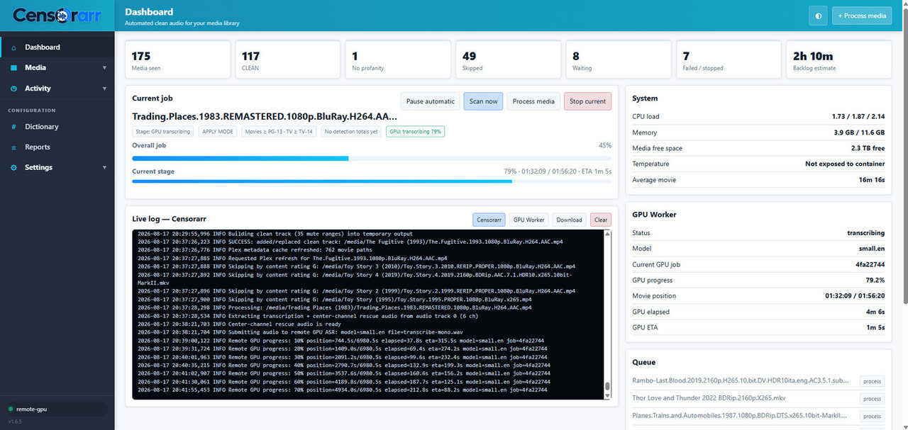
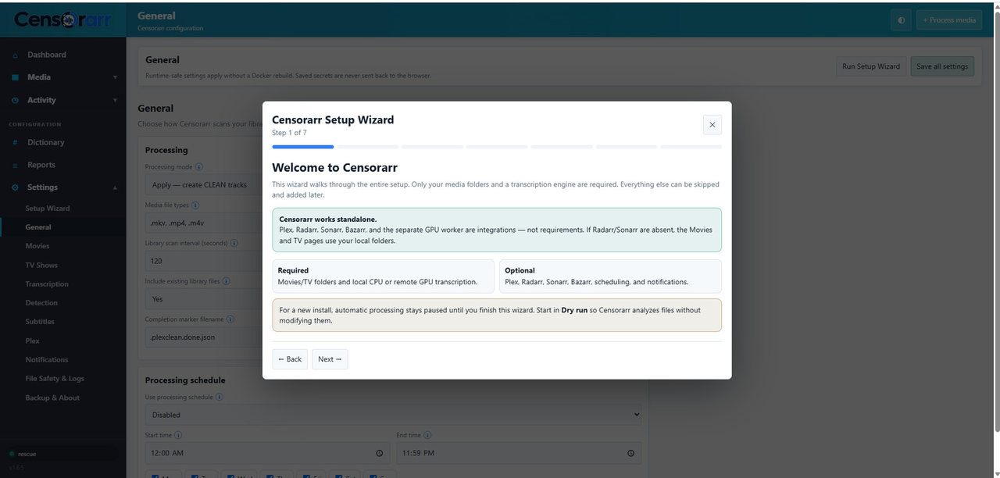
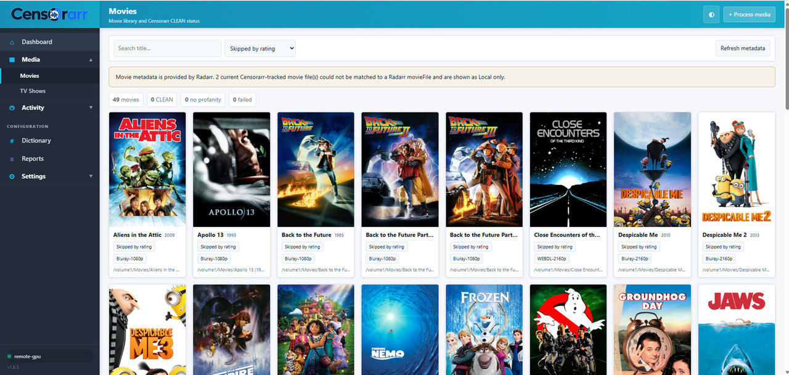
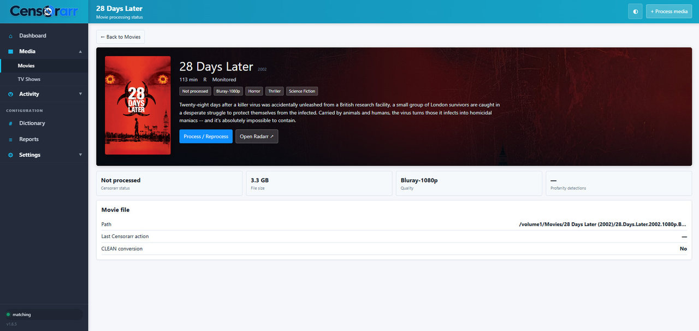

# Censorarr 1.6.8

Censorarr is a self-hosted clean-audio manager for movies and TV shows. It detects configured profanity, keeps the original media streams, and adds or replaces a separate **CLEAN** audio track.

## Documentation

The complete installation, configuration, integration, GPU-worker, permissions, updating, and troubleshooting documentation is in the **[Censorarr Wiki / Documentation](wiki/Home.md)**.

Start with **[Quick Start](wiki/Quick-Start.md)**. Platform-specific guides are available for **[Windows](wiki/Windows-Installation.md)**, **[Native Linux](wiki/Linux-Installation.md)**, **[Synology Container Manager](wiki/Synology-Container-Manager.md)**, and **[Docker / Linux](wiki/Docker-Linux.md)**.

## Windows installer

Censorarr can run natively on **Windows 11 x64** without Docker.

**[Download the latest Windows installer from GitHub Releases](https://github.com/leestow/Censorarr/releases/latest)**

The Windows installer is named:

```text
Censorarr-Setup-X.Y.Z.exe
```

It installs the application under `C:\Program Files\Censorarr`, stores persistent configuration and state under `C:\ProgramData\Censorarr`, bundles FFmpeg/FFprobe, and opens the same Censorarr web interface at `http://127.0.0.1:8087`. The Setup Wizard supports local drives, mapped drives, and reachable UNC network paths.

See **[Windows Installation](wiki/Windows-Installation.md)** for the full guide.

## Native Linux package

Censorarr can also run natively on **Debian/Ubuntu-family x86_64 Linux** without Docker.

**[Download the latest Linux `.deb` from GitHub Releases](https://github.com/leestow/Censorarr/releases/latest)**

The package is named:

```text
Censorarr-X.Y.Z-linux-amd64.deb
```

Install it with:

```bash
sudo apt install ./Censorarr-X.Y.Z-linux-amd64.deb
```

The package installs Censorarr under `/opt/censorarr`, keeps persistent data under `/var/lib/censorarr`, creates a `censorarr` system user and `systemd` service, and uses the distribution FFmpeg package. The web UI binds to `127.0.0.1:8087` by default; headless/LAN deployments can enable network access in `/etc/default/censorarr`.

See **[Native Linux Installation](wiki/Linux-Installation.md)** for media permissions, LAN access, service commands, and updating.

## Native GPU Worker installers

The optional NVIDIA GPU Worker now has native installers too:

```text
Windows: Censorarr-GPU-Worker-Setup-X.Y.Z.exe
Linux:   Censorarr-GPU-Worker-X.Y.Z-linux-amd64.deb
```

**[Download GPU Worker installers from GitHub Releases](https://github.com/leestow/Censorarr/releases/latest)**

The native GPU Worker installers generate the worker token, install/start the worker service/task, and download the pinned CUDA 12 / cuBLAS / cuDNN runtime libraries directly from NVIDIA-maintained PyPI packages. Each runtime wheel is verified by SHA-256 and extracted into the worker's private data directory. The NVIDIA display/compute driver remains a prerequisite and is not replaced by Censorarr.

Docker GPU Worker deployment remains fully supported.

See **[Transcription & GPU Worker](wiki/Transcription-and-GPU-Worker.md)** for the complete native and Docker worker guides.

## What is required?

Only two things are required:

1. A Movies and/or TV media folder available to Censorarr.
2. A transcription engine: the local CPU, or the optional **Censorarr GPU Worker**.

Everything else is optional:

- **Plex** — adds rating-based filtering, playback-aware start gating, and library refreshes.
- **Radarr** — adds richer movie posters and metadata. Without it, the Movies page reads the local Movies folder directly.
- **Sonarr** — adds richer TV/episode metadata. Without it, the TV Shows page reads the local TV folder directly.
- **Bazarr** — can request missing text subtitles automatically. Local and embedded subtitle assistance works without Bazarr.
- **GPU Worker** — accelerates Whisper transcription. Censorarr can run transcription locally on CPU instead.

## First-run Setup Wizard

Fresh installations open a guided Setup Wizard automatically and remain idle until setup is completed. The wizard can be reopened later from **Settings → Setup Wizard**.

It walks through:

1. Movies and TV folders, plus Dry Run / Apply mode.
2. Local CPU vs remote GPU transcription.
3. Optional Plex setup.
4. Optional Radarr and Sonarr setup.
5. Subtitle assistance and optional Bazarr setup.
6. A final review before automatic processing is enabled.

**Start with Dry Run and test a small number of files before switching to Apply mode.**

## Installation choices

| What you want | What to install |
|---|---|
| Native Windows 11 x64 | `Censorarr-Setup-X.Y.Z.exe` from GitHub Releases |
| Native Debian/Ubuntu x86_64 | `Censorarr-X.Y.Z-linux-amd64.deb` from GitHub Releases |
| Native Windows GPU Worker | `Censorarr-GPU-Worker-Setup-X.Y.Z.exe` from GitHub Releases |
| Native Debian/Ubuntu GPU Worker | `Censorarr-GPU-Worker-X.Y.Z-linux-amd64.deb` from GitHub Releases |
| Docker / Synology using CPU transcription | Main Censorarr project only |
| Docker / Synology with NVIDIA GPU acceleration | Main Censorarr + Docker GPU Worker |
| No Plex / Radarr / Sonarr / Bazarr | Main Censorarr standalone |

### Docker / Synology Censorarr

See [`INSTALL-FIRST.txt`](INSTALL-FIRST.txt), [`INSTALL-SOURCE.md`](INSTALL-SOURCE.md), and [`README-SYNOLOGY.md`](README-SYNOLOGY.md).

The included `docker-compose.yml` is a starting point. Change the host-side media paths, PUID/PGID, and any optional integration settings for your environment. On Synology, the shipped `CENSORARR_SYNOLOGY_COMPAT_MODE=auto` keeps normal PUID/PGID behavior but can fall back to container root when DSM ACLs make the media mount inaccessible to that numeric identity.

### GPU Worker

Native installer and Docker options are documented in [`gpu-worker/README.md`](gpu-worker/README.md).

Docker quick start:

```bash
git clone https://github.com/leestow/Censorarr.git
cd Censorarr/gpu-worker
# Edit docker-compose.yml and set ASR_WORKER_TOKEN
docker compose up -d --build
```

## How CLEAN audio works

Censorarr preserves the original media streams and creates a separate profanity-muted audio track. Reprocessing replaces the existing CLEAN track instead of stacking additional CLEAN tracks.

Whisper performs the primary transcription. Censorarr can also use subtitle evidence and targeted rescue passes to improve recall. No speech-recognition system can guarantee 100% detection, so review/test important material before relying on automated processing.

## Safety

Censorarr writes a temporary output, validates it, and only then replaces the original pathname. Keep backups of important media and begin with **Dry Run** when evaluating a new installation.

## Credentials

Never commit runtime configuration or secrets. In particular, do not commit:

- `config/`
- `secrets.json`
- `.env` files
- API tokens
- logs/reports
- Whisper models
- backup snapshots containing configuration

The repository `.gitignore` excludes common runtime and secret locations, but you should still review changes before pushing them publicly.

## Acknowledgements

Censorarr's transcription engine is built on [faster-whisper](https://github.com/SYSTRAN/faster-whisper), created by [Guillaume Klein](https://github.com/guillaumekln) and maintained with contributions from the faster-whisper community. Its CTranslate2-based implementation of Whisper provides the fast, memory-efficient speech-to-text foundation that makes Censorarr's detection pipeline possible.

A sincere thank-you to Guillaume Klein and everyone who has contributed to faster-whisper for making their work available to the open-source community.

faster-whisper itself is based on OpenAI's [Whisper](https://github.com/openai/whisper) speech-recognition model, so Censorarr also gratefully acknowledges the original Whisper project and its contributors.

## License

Censorarr is released under the **GNU General Public License v3.0 (GPL-3.0)**. See [`LICENSE`](LICENSE).

## Project status

Censorarr is under active development. Bug reports, compatibility reports, and contributions are welcome through GitHub Issues and Pull Requests.

<!-- CENSORARR-SCREENSHOTS -->
## Screenshots

### Dashboard

Monitor current processing, queue status, system resources, GPU-worker progress, and live Censorarr/GPU logs from one place.



### First-run Setup Wizard

Fresh installations include a guided wizard for media folders, transcription, and optional integrations.



### Movies library

Browse the movie library with posters, quality information, ratings, and Censorarr processing status.



### Movie details

Open an individual movie to see its metadata, file information, CLEAN status, and processing actions.


